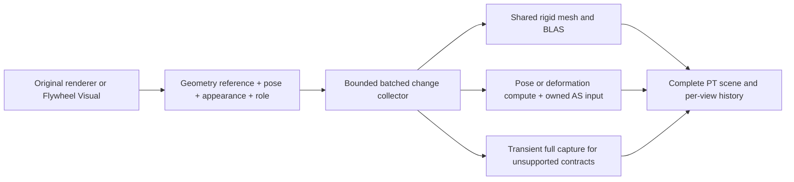

# Draw intent, persistent models and pose-driven PT input

迁移日期：2026-10-09；原始观察日期：2026-09-29。本次只迁移结构，不将历史结果提升为本轮验证。

## 问题

保留原调查的范围、证据等级与未完成事项。当前实现与批准的产品约束以[项目现状](../project/status-current.md)为索引。

## 方法

原始记录来自 Radiance 迁移前的已提交源码与对应证据。以下保留原文与日期，避免重新解释历史失败。

## 发现

Observed on: 2026-09-29.
Status: investigated architecture proposal; no implementation or new performance result.
Evidence: pinned source, dependency bytecode and published API/specification; prior measurements
are explicitly historical. No subagents, builds, clients, instance changes or Git history changes.

## Scope and source identities

- Radiance `8ad46a0967d66c4ed5e9b0b9c3a938409e4905bc` and MCVR
  `e6e8153e0ff8c3ab6c3108d8d631beea1f99810e`; both worktrees were clean before research.
- Target Minecraft1.21.1 / NeoForge21.1.251 source artifact; Create6.0.10,
  Aeronautics/Simulated1.3.2, Sable2.0.5, Veil4.3.2 from the pinned local compile inputs.
- Actual Flywheel1.0.6 binary SHA-256
  `31dda15c205eb596d3b3449ef03f6af7363a6cd35b3da4bfe916b304f9e5337e`.
  Its [published source archive](https://maven.createmod.net/dev/engine-room/flywheel/flywheel-neoforge-1.21.1/1.0.6/flywheel-neoforge-1.21.1-1.0.6-sources.jar)
  hashes to `c251479dea729a568bedee28bb68021276f4b49be0a5b6a9603501729d5dfbfe`.
- Flywheel/Vanillin reference tree `9189ad50d1b7bf59873043ebf06c21894b551573`
  declares Flywheel1.0.7 / Vanillin1.1.4. It is a separately labeled reference, not the
  installed1.0.6 binary or proof that Vanillin is installed. The local Create source checkout
  declares6.0.11, so it was not substituted for the actual6.0.10 artifact.
- Non-portable source/bytecode evidence and hashes:
  `D:/Workspaces/Artifacts/RadianceDrawIntentResearch/20260929/` (`MANIFEST.json`, exact-version
  Flywheel sources, Minecraft source excerpts and selected pinned-mod javap output).

The user's latest spawn-disabled comparison is motivation, not producer attribution. It does
not separate simulation, entity count, renderer work, AS work or display/real frame rates.

## Decision

Pursue a persistent model/instance input layer shared by existing Flywheel integration and new
ordinary-model adapters. Reuse the existing native geometry, AS lifetime and error-boundary
foundations. Keep a correct transient capture route for unproven producers.

The architectural change is the lifetime and granularity of the data: local mesh resources,
instance/part state and material state become separate objects. A common interface alone is
insufficient if callers still regenerate full vertices or the backend reconstructs every record.
This proposal does not turn all renderer implementations into automatically cacheable models.

No camera culling, lower offscreen animation frequency, geometry/quality reduction or world
post-raster drawing is accepted as the optimization. Existing first-person, priority geometry,
ordinary alpha versus physical transmission and default Ponder raster semantics remain intact.

## What Flywheel actually contributes

Exact1.0.6 `Visual`, `DynamicVisual`, `TickableVisual`, `Instance` and `InstanceHandle` distinguish
object lifetime, tick/frame updates, dirty notification, visibility and deletion. Its indirect
backend keeps model data separate from instance pages. `IndirectInstancer.uploadInstances()`
returns immediately with no dirty pages; instance-content and validity changes are separate.
This is an explicit producer contract, not inference from a sequence of OpenGL calls.

`VisualizationManagerImpl` also waits for visual work before rendering and deletion. Retain that
ordering when collecting instances; background writers must not race a consumed snapshot.
Thread-safe Flywheel plans do not make arbitrary Minecraft or mod render callbacks thread-safe.

[Vanillin's registration examples](https://github.com/Engine-Room/Flywheel/blob/9189ad50d1b7bf59873043ebf06c21894b551573/common/src/vanillin/java/dev/engine_room/vanillin/VanillaVisuals.java)
cover selected chests, bells, shulker boxes, displays, minecarts, item frames and items, with
some entries experimental. This demonstrates a useful adapter pattern, not coverage of all
living models, every attached render layer, particles or arbitrary mods. No additional mod
dependency or source copying is proposed as an automatic installation step.

Important incompatibility: reference `ChestVisual.beginFrame()` returns early for distance
limiting or failed frustum visibility before updating its lid. Exact1.0.6 Flywheel's manager
provides a real frustum and configurable distance limiter, and the local backend replacement
does not itself replace that context. A PT adapter must preserve necessary offscreen animation;
merely replacing GPU culling or TLAS submission is insufficient. The actual extent of such
gates across installed visuals remains a targeted coverage gap, not a claim all visuals freeze.

## Local producer-to-consumer findings

| Path | Current source behavior | Remaining work relevant to this direction |
| --- | --- | --- |
| Flywheel | `RadianceFlywheelEngine.ModelState` captures/uploads a model once; handles store dirty state. Native `Instancing` shares model buffers and BLAS. Eight exact affine instance-layout adapters are supported. | `flush()` still scans handles, each dirty handle allocates/writes a buffer and calls JNI; embedding updates mark dependent instances dirty. Native preparation decodes all live instances, allocates a vector, sorts by bias and rebuilds appearance/history/geometry-address records. Model reuse is already present; submission and organization are not fully incremental. |
| Ordinary baked models | Opt-in `RigidModelCapture` bypasses transformed per-vertex emission for eligible `SimpleBakedModel` draws, retaining renderer/tint callbacks and cached native BLAS. | Each draw still builds/clones a quad recipe and compares it with a bounded linear cache. Appearance/light/overlay data participate in the recipe key. It is not yet a geometry-independent instance-state system. |
| ModelPart experiment | Opt-in `PartModelCapture` intercepts compile after original pose traversal. It snapshots local cubes, retains current poses and has bounded caches/history identities. | `Snapshot.matches()` traverses source positions/UV/normals on use; cached entries include light/overlay/color. Each part creates a separate rigid submission; native queueing allocates an Entity record and world preparation expands its metadata. |
| Particles | `EntityProxy.queueParticleRebuild()` invokes each buffered particle's render method, groups output by current material/content/emission and submits generated buffers. Custom particle types retain a separate capture path. | Standard `SingleQuadParticle` already exposes a compact pre-expansion description: position interpolation, quaternion/roll, size, UV rectangle, color/alpha and light. This can support an intent adapter without replacing particle simulation. |
| Sable terrain | `SableSubLevelBridge` and external sections retain section identities and separate section rebuilds from structural motion. | Preserve that existing ownership/dirty-generation path. A moving whole structure is not a reason to re-expand every block. Block entities, contained entities, visuals and procedural connections remain distinct producers. |
| Aeronautics/Simulated | Actual1.3.2 bytecode shows `SimplePropellerVisual` using ORIENTED, and `TorsionSpringVisual` using ROTATING/ORIENTED instances. Flexible `SpringRenderer` instead generates spline/segment vertices through a VertexConsumer. | Do not label all aeronautics as one instancing workload. Reuse existing visual instances; classify flexible geometry separately and retain its exact topology, UVs and stress material. |

Relevant local sources: `client/vertex/{RigidModelCapture,PartModelCapture}.java`,
`mixins/vulkan_render_integration/ModelPartPersistentMixins.java`,
`client/proxy/world/EntityProxy.java`, `compatibility/flywheel/`, `compatibility/sable/`,
and MCVR `src/core/render/{entities,instancing}.cpp`,
`modules/world/ray_tracing/submodules/world_prepare.cpp`.

### Historical evidence that constrains the design

The first baked-model prototype improved the historical static sample47.615->42.952ms and
route49.93->45.71ms. It remains a bounded result from its original artifacts and scene.

The later ModelPart A/B had **no useful net gain**: static44.47->44.77ms and route46.94->47.58ms.
Dynamic PBR vertices fell91163->46810, but rigid instances rose490->2278. Native rigid queue time
rose0.182->0.720ms and entity metadata1.648->2.347ms. GPU entity BLAS time fell1.107->0.928ms,
while TLAS time rose only0.189->0.214ms. The issue is not adequately described as TLAS GPU cost
alone. Do not sum inclusive/overlapping timers or treat the figures as current measurements.
See the existing ledger（归档位置：`D:\Workspaces\Artifacts\Radiance\history-archive\Radiance\docs\DEVELOPMENT_LEDGER.md#2026-09-25-bounded-modelpart-persistence-experiment`）.

## Proposed input contract

Provisional responsibilities, not committed API names:

| Record | Contents and lifetime |
| --- | --- |
| GeometryTemplate | Immutable local positions, authored normals/UVs, indices/triangulation, part membership and submesh material slots; explicit asset/geometry revision. Capture at bake/creation or real invalidation. |
| AppearanceState | Actual texture/sampler owners, tint/overlay, alpha/cutout/transmission, emission and per-draw or per-submesh attributes. Nonuniform per-vertex attributes require an appropriate stream or fallback, not reduction to one RGBA. |
| PoseState | Current/previous root and part matrices, provided normal matrices, visibility and deformation parameters. Preserve interpolation and callback timing. |
| SceneInstance | Stable owner plus generation, geometry reference, transform/appearance references, parent structure and ray/pass roles; explicit creation/deletion and world/resource epochs. |
| Frame snapshot | Immutable or versioned submitted changes with ownership lasting through GPU consumers and temporal-history readers. Bounded pages/batches, no scan/reset proportional to unused capacity. |

Backend storage keys must reflect actual compatible layouts/topology/material/face semantics;
neither a texture name nor renderer class proves geometry immutability. Shader/texture reload,
model replacement, mutable quad contents, material flags and source-wrapper changes need explicit
invalidation or a proven fallback. Avoid per-frame full vertex expansion followed by hashing.
Public mutable model arrays and third-party Mixins prevent a universal dirty-notification claim.

Original pose/layer callbacks may continue every frame while expensive mesh expansion is skipped.
For ordinary capture, a draw that disappears this frame must not remain visible merely because its
template is resident. Reuse without resubmission requires a producer with explicit lifetime and
visibility notifications. Offscreen camera visibility is separate from semantic object visibility.

Batch JNI updates and dirty pages should replace per-part native allocations/calls. Separate
resource creation from instance submission so a known template is referenced by handle, not
repeatedly offered as a full vertex pointer. Retain the existing transient fallback and resource
retainer. Limit the first implementation to persistent dynamic-model records; whole-world stable
scene tables, render-origin redesign, PTLAS, SER and arena migration remain separate decisions.

## Geometry classes need different PT execution

| Content | Proposed treatment | Important bound |
| --- | --- | --- |
| Whole rigid model | Shared local mesh and shared BLAS; instance transform/material changes only. | Uniform/negative/nonuniform scale and normal contracts must be supported or explicitly fall back. |
| Articulated ModelPart actor | Shared base mesh plus part-index/palette data. Compare batched rigid parts with GPU part transforms into a per-actor or few-submesh posed mesh. | Different poses cannot use one unchanged whole-model BLAS. Prefer avoiding thousands of tiny Java/JNI submissions; choose final granularity from total measured cost. |
| Standard billboard particles | Shared quad template plus current sampled particle parameters; compare instance batches against compute-expanded bounded particle pages. | Keep original camera orientation for the frame even in reflection/shadow queries. Do not turn each quad toward each ray. Preserve dynamic UV/size/light/color getters and custom renderer fallback. |
| Springs, ropes and other real deformation | Explicit spline/control/shape parameters and GPU generation only where the original algorithm is fully specified; otherwise preserve source capture. | Same object type does not imply fixed topology. Segment-count, winding, twin-quad UV and material changes remain authoritative. No geometry redesign to hide the unresolved spring/face defect. |
| Sable/contraption hierarchy | Reuse static local geometry; separate parent transform from child appearance/pose updates. | One changed parent can still require many TLAS instance transforms. A small upload does not mean no AS work. |
| Unknown/custom programmatic render | Correct existing capture with diagnostics explaining ineligibility. | General coverage of rendering is possible; zero per-frame geometry production for every arbitrary program is not established. |

Minecraft's ordinary ModelPart pipeline is often rigid part transformation, not weighted skeletal
skinning. Preserve its actual pose and normal matrices instead of inventing bone weights. Whole-
actor GPU posing shares base resources, while each different current pose needs correct AS input.
Keep material-only changes separate so hurt color or a light change does not create another mesh.
Do not assume every per-vertex color/light quantity is uniform.

The native AS builders expose update mode, but that is not proof the new use is legal. Vulkan
requires update-compatible original builds and unchanged topology/counts/formats/geometry flags.
Changing active/inactive primitives or instances also requires rebuild under the ordinary KHR
contract. Visibility, new particles and material-driven geometry flags cannot be blindly treated
as refit. Compute-produced positions need synchronization before AS reads; built AS and instance
data need correct dependencies before tracing. In-flight old buffers/AS and previous-position
history must stay alive until their actual last readers finish. No global GPU-idle-per-update.
See [Khronos AS rules](https://docs.vulkan.org/spec/latest/chapters/accelstructures.html).

## Semantic and ownership gates

1. Keep animation, renderer/layer callbacks, item/model overrides and necessary mod hooks. Actual
   ModelPart visibility, skipDraw, children, normal matrices and draw order must remain observable.
   Wrappers for glint, outlines, texture projection and extra layers cannot be silently bypassed.
2. Keep full PT participation, priority geometry, first-person roles and physical alpha semantics.
   Store face rules per appropriate geometry; do not force mixed models into one cull rule.
   The known global single-sided transport and Flywheel cutoff/filtering findings stay explicit.
3. The same source can produce world, UI or diagram draws with different camera/material/visibility
   semantics. Share immutable assets only when valid; keep scene execution/history separate.
   Ponder PT remains archived. This work does not revive it or change diagram producer preferences.
4. Separate dirty geometry, pose, appearance, membership and resource generations. Handle reuse
   must reject old uploads/deletes/queued commands atomically at use, while GPU retirement remains
   independent. Capacity exhaustion must backpressure/fall back safely, not steal live slots.
5. Preserve double-precision placement before float conversion, Sable parent composition, prior
   transforms and reload/world-switch history resets. Same-count draw reordering needs stable
   logical draw/part identity, not just an ordinal.
6. Use existing typed failure/sticky-fatal/JNI/worker cleanup boundaries. New cached resources must
   tolerate failed creation, cancelled publishing, repeated close and normal versus lost-device exit.

## Recommended implementation sequence after authorization

1. **Capture a current producer baseline and build the smallest shared contract.** Reuse Audit to
   separate callbacks, local-geometry checks, expansion, material capture, JNI, scene organization,
   AS and GPU work. Do not deduce the winner from the spawn-toggle FPS alone. Add only the counters
   needed to connect these costs to owners/templates/dirty reasons.
2. **Batch the already-persistent paths and separate appearance from geometry.** Start with existing
   Flywheel and rigid-model submissions, preserving frontend behavior. Use stable handles, bounded
   dirty batches and shared appearance/parent records; demonstrate reduced calls and allocations.
   This addresses the costs that defeated the previous ModelPart experiment before wider rollout.
3. **Run one actor-level pose experiment against the old part experiment.** A high-volume measured
   ModelPart producer should compare batched part instances with shared-base GPU posing into a
   coarser actor mesh. No unconditional per-cube TLAS plan and no automatic default enablement.
4. **Add standard particle intent and then procedural adapters separately.** Preserve ticking on
   its original thread. Evaluate quad instancing versus bounded mesh pages with matched counts and
   spawning/despawning. Extend Create/Aeronautics through their existing visuals first; flexible
   connections need a separate exact deformation contract and their existing visual limitations.

This is one extensible architecture with independently measured vertical slices, not authorization
to implement every slice now. The existing default-off ModelPart experiment remains default off.

## Validation and decision criteria

- A/B with identical world/camera/time/weather/resources, draw coverage and quality; separate
  static, moving, animation-heavy and birth/death/reload cases. Muted automatic clients stay in
  repository run directories. Heavy dual-path checks stay outside formal timing.
- Count actual local mesh production, per-source comparisons, generated versus referenced vertices,
  changed bytes, JNI batches, BLAS builds/updates, TLAS instances, metadata allocations and memory
  peaks, alongside real frame mean/p95/p99 and run-to-run spread. Logical bytes are not all PCIe traffic.
- Compare actual old/new geometry, UVs, material identity, normals, face acceptance, current/previous
  poses and motion data, plus visible shadows/reflections/priority output. RGB averages alone cannot
  prove coverage. Keep user visual acceptance separate from machine checks.
- Exercise multiple actors sharing a model with different poses/materials, direct cube mutations,
  visibility/layer changes, mirror/nonuniform transforms, Sable movement, reload, destruction/reuse,
  world changes, pending GPU work and partial failures. Test unknown-producer fallback explicitly.
- Require a repeated whole-frame improvement beyond run spread and bounded memory with semantic
  parity before enabling or expanding. If bytes fall but native organization/AS/tracing rises enough
  to cancel the gain, retain the result as a failed performance candidate.

## Remaining unknowns and excluded work

No new profiling was run; current workload coverage and bottleneck share remain unmeasured.
Only selected Aeronautics/Simulated producers were bytecode-checked, not every renderer or Mixin.
The full set of visual-internal culling/update gates, custom model mutation contracts, material
variants, optimal actor/particle AS granularity and long-duration memory behavior remain open.
Vanillin is an implementation reference; its exact compatibility with our backend was not tested.

No FPS multiplier, all-entity acceleration or zero-update cost is promised. This direction reduces
repeated production and submission where contracts permit; it does not remove necessary game
simulation, actual changing geometry, BVH work or PT shading. Historical GPU faults, public DLL
licensing and unrelated visual tasks are not closed by this source study.

## 结论

本次迁移不实施研究中的提案，也不重新判定视觉、性能或设备丢失根因。旧台账与闭合审计保留在仓库外历史存档。
